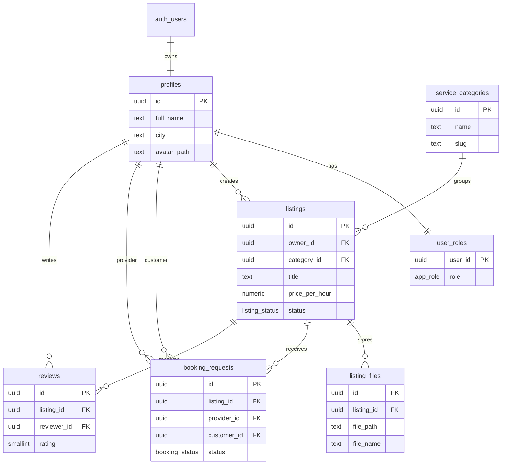

# SkillBridge

SkillBridge is a multi-page JavaScript capstone project for the SoftUni AI course "Software Technologies with AI". It is a local services marketplace where users can register, publish services, upload photos or documents, request bookings, review listings and use an admin panel for moderation.

## Project Info

| Field | Value |
| --- | --- |
| Author | Aleks Georgiev |
| Email | aleksgeorgiev2324@gmail.com |
| GitHub Repo | https://github.com/aleksgeorgiev2324-dev/skillbridge-capstone |
| Live Project URL |https://skillbridge-capstone.netlify.app/ |
| Demo user | `skillbridge.demo2@gmail.com` / `Demo123!` |
| Demo admin | `skillbridge.admin@gmail.com` / `Admin123!` |

The demo accounts must be created in Supabase Auth after the project is connected to a real Supabase project. See `supabase/seed.sql` for the admin role helper.

## Features

- Supabase Auth registration, login and logout.
- Role-based access with regular users and admins.
- Multi-page Vite app with separate HTML files for home, auth, dashboard, profile, listing details, listing form and admin panel.
- Listing CRUD with categories, city, status and hourly price.
- Booking requests between customers and providers.
- Reviews with rating validation.
- File uploads and signed downloads through Supabase Storage.
- Admin panel for listing moderation, user overview and category creation.
- Responsive Bootstrap UI with icons, alerts, tabs, tables and mobile-friendly layout.

## Tech Stack

- HTML, CSS, JavaScript
- Bootstrap and Bootstrap Icons
- Node.js 20.19+ or 22.12+, npm, Vite
- Supabase Auth, Postgres DB, Storage and Row-Level Security
- Netlify-ready static deployment config

## App Screens

- `index.html` - browse and search published services.
- `pages/register.html` - create account.
- `pages/login.html` - login.
- `pages/dashboard.html` - provider/customer dashboard.
- `pages/profile.html` - edit profile and avatar.
- `pages/listing-form.html` - add/edit/delete service and upload files.
- `pages/listing-detail.html` - view service, download files, book and review.
- `pages/admin.html` - admin moderation and category management.

## Architecture

The frontend is a Vite-powered multi-page app. Each page imports a focused controller from `src/js/pages`. Shared behavior is split into services, auth helpers, UI utilities, Supabase client setup and navigation rendering.

```text
Browser pages
  -> page controllers in src/js/pages
  -> services in src/js/services
  -> Supabase JS client
  -> Supabase REST/Auth/Storage APIs
```

## Database Schema



## Local Setup

1. Install dependencies:

   ```bash
   npm install
   ```

2. Copy environment variables:

   ```bash
   cp .env.example .env
   ```

3. Add your Supabase keys in `.env`:

   ```bash
   VITE_SUPABASE_URL=https://your-project-ref.supabase.co
   VITE_SUPABASE_ANON_KEY=your-public-anon-key
   ```

4. Apply the database migration:

   ```bash
   supabase link --project-ref your-project-ref
   supabase db push
   ```

   If you are not using the Supabase CLI, run `supabase/migrations/202607130001_initial_schema.sql` in the Supabase SQL editor.

5. Start the app:

   ```bash
   npm run dev
   ```

## Supabase Setup Notes

- The migration creates 7 public tables, indexes, triggers, enum types, RLS policies and two Storage buckets: `listing-files` and `profile-avatars`.
- Register `demo@skillbridge.test` and `admin@skillbridge.test` in the app or Supabase Dashboard.
- Run `supabase/seed.sql` after creating the admin account to assign the `admin` role.
- Keep the anon key public, but never commit the Supabase service role key.

## Deployment

The project includes `netlify.toml`.

1. Push the repo to GitHub.
2. Create a Netlify site from the repo.
3. Set build command to `npm run build`.
4. Set publish directory to `dist`.
5. Add `VITE_SUPABASE_URL` and `VITE_SUPABASE_ANON_KEY` as Netlify environment variables.
6. Deploy and copy the live URL into the table above.

## Key Folders

- `.github/copilot-instructions.md` - AI agent instructions required by the assignment.
- `pages/` - separate multi-page screens.
- `src/js/pages/` - page-specific controllers.
- `src/js/services/` - Supabase data access modules.
- `src/js/auth.js` - authentication and role helpers.
- `src/styles/main.css` - Bootstrap imports and custom responsive styles.
- `supabase/migrations/` - committed database migrations.
- `supabase/seed.sql` - optional demo/admin seed helpers.
- `docs/` - assessment and commit planning notes.

## Assessment Coverage

| Criterion | Status |
| --- | --- |
| GitHub commits | Commit plan included in `docs/COMMIT_PLAN.md`; must be executed in GitHub repo. |
| Commit days | Plan splits commits across 3 days. |
| Architecture | Vite, npm, modular vanilla JS and multi-page navigation. |
| App screens | 8 screens. |
| Database | 7 tables with relations, indexes and migrations. |
| Admin panel | Role-based admin page with moderation. |
| File storage | Listing file uploads/downloads and profile avatars. |
| Deployment | Netlify config included; requires real account connection. |
| Auth and security | Supabase Auth plus RLS policies. |
| Documentation | README, schema diagram, setup guide and docs folder. |

## Submission Notes

The project includes a Vite multi-page frontend, Supabase database schema, authentication, storage policies, admin panel, documentation and deployment configuration.
